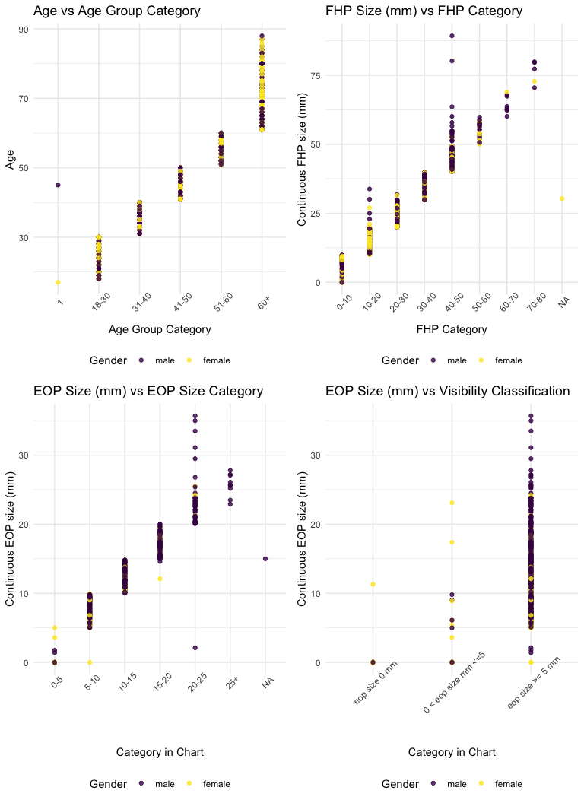
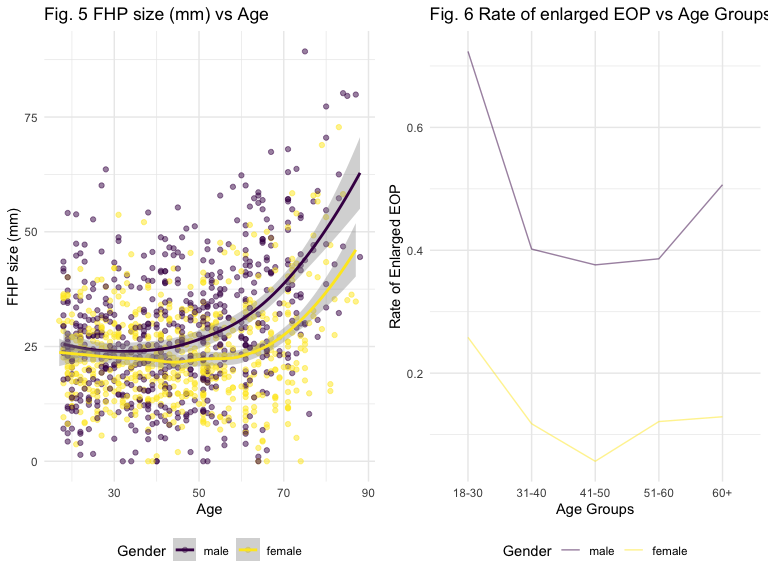
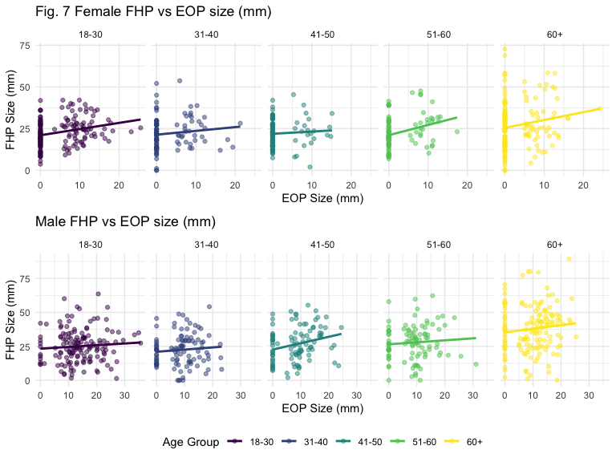

p8105\_mtp\_sl4662
================

# Problem 1

Some age group does not match the age. Age group 1 is not suppose to
appear, and there is an age 45, with age group 1.

``` r
mtp_data = 
  read_excel("p8105_mtp_data.xlsx", 
             skip = 8) %>% 
  janitor::clean_names() %>% 
  mutate(
    eop_size_mm = replace(eop_size_mm, is.na(eop_size_mm), "0"), 
    eop_size_mm = as.double(eop_size_mm), 
    sex = factor(sex, levels = c("1", "0")), 
    sex = fct_recode(sex, female = "0", male = "1"), 
    age_group = factor(age_group, levels = c("1", "2", "3", "4", "5", "6", "7", "8")),  
    age_group = fct_recode(age_group, 
                           "18-30" = "2", 
                           "31-40" = "3", 
                           "41-50" = "4", 
                           "51-60" = "5", 
                           "60+" = "6", 
                           "60+" = "7", 
                           "60+" = "8"),
    eop_size = factor(eop_size, levels = c("0", "1", "2", "3", "4", "5")), 
    eop_size = fct_recode(eop_size, 
                          "0-5" = "0", 
                          "5-10" = "1", 
                          "10-15" = "2", 
                          "15-20" = "3", 
                          "20-25" = "4", 
                          "25+" = "5"), 
    eop_visibility_classification = factor(eop_visibility_classification, levels = c("0", "1", "2")), 
    eop_visibility_classification = fct_recode(eop_visibility_classification, 
                                               "eop size 0 mm" = "0",
                                               "0 < eop size mm <=5" = "1", 
                                               "eop size >= 5 mm" = "2"),
    fhp_category = factor(fhp_category, levels = c("0", "1", "2", "3", "4", "5", "6", "7")),
    fhp_category = fct_recode(fhp_category, 
                              "0-10" = "0", 
                              "10-20" = "1", 
                              "20-30" = "2", 
                              "30-40" = "3", 
                              "40-50" = "4", 
                              "50-60" = "5", 
                              "60-70" = "6", 
                              "70-80" = "7")
    )

  
# levels(mtp_data$age_group) = c("1", "20+", "30+", "40+", "50+", "60+", "60+", "60+")

age_female = 
  mtp_data %>% 
  filter(sex == "female") %>% 
  group_by(age_group) %>% 
  summarize(female_number = n())

age_male = 
  mtp_data %>% 
  filter(sex == "male") %>% 
  group_by(age_group) %>% 
  summarize(male_number = n())

age_table = 
  left_join(age_female, age_male, by = "age_group") 

knitr::kable(age_table)
```

| age\_group | female\_number | male\_number |
| :--------- | -------------: | -----------: |
| 1          |              1 |            1 |
| 18-30      |            151 |          152 |
| 31-40      |            102 |          102 |
| 41-50      |            106 |          101 |
| 51-60      |             99 |          101 |
| 60+        |            155 |          150 |

This dataset is consist of many different variables, and some variables
have conclusive variables following them to classify the results into
different groups.

Key variables include `age`, `sex`, `eop_size_mm`, `fhp_size_mm`.

There are 9 variables and 1221 observations in this data set. There is a
total of 1221 participants.

``` r
eop1 = 
mtp_data %>%
  ggplot(aes(x = eop_size, y = eop_size_mm, color = sex)) + 
    geom_point(alpha = 0.8) + 
    labs(
    color = "Gender",
    title = "Fig.3 EOP Size (mm) vs EOP Size Category",
    x = "Category in Chart",
    y = "Continuous EOP size (mm)") +
  theme(axis.text.x = element_text(angle = 45))
eop2 = 
mtp_data %>%
  ggplot(aes(x = eop_visibility_classification, y = eop_size_mm, color = sex)) + 
    geom_point(alpha = 0.8) + 
    labs(
    color = "Gender",
    title = "Fig.4 EOP Size (mm) vs Visibility Classification",
    x = "Category in Chart",
    y = "Continuous EOP size (mm)") +
  theme(axis.text.x = element_text(angle = 45))

fhp = 
mtp_data %>%
  ggplot(aes(x = fhp_category, y = fhp_size_mm, color = sex)) + 
    geom_point(alpha = 0.8) + 
    scale_y_continuous(
      breaks = c(0, 10, 20, 30, 40, 50, 60, 70, 80, 90)) +
    labs(
    color = "Gender",
    title = "Fig.2 FHP Size (mm) vs FHP Category",
    x = "FHP Category",
    y = "Continuous FHP size (mm)") +
  theme(axis.text.x = element_text(angle = 45)) 

age = 
mtp_data %>%
  ggplot(aes(x = age_group, y = age, color = sex)) + 
    geom_point(alpha = 0.8) + 
    labs(
    color = "Gender",
    title = "Fig.1 Age vs Age Group Category",
    x = "Age Group Category",
    y = "Age") +
  theme(axis.text.x = element_text(angle = 45))
  
(age + fhp) / (eop1 + eop2)
```



In Fig.1, there are two observations that’re categorized in the wrong
age group. Since we have over one thousand observation in this data set,
the small error in age group would not make a huge impact on the overall
statistics.

In Fig.2 and Fig. 3, multiple observations, mostly males, are placed in
the wrong group, which may have an impact on the overall statistics
involving EOP size (10-25mm) and FHP size (40-50mm) about males.

In Fig.4, there is major mistakes in EOP size 0 mm and EOP size 0-5 mm
group, because most observations in these two groups are misplaced, and
making conlusion based on these two groups will give wrong results. In
addition, a samll portion of EOP Size \>= 5mm does not belone in that
group, which shouldn’t have a big impact.

``` r
age_based = 
  mtp_data %>% 
  filter(sex == "female") %>% 
  count(age) %>% 
  group_by(age > "17" & age < "31", age > "30" & age < "41") %>% 
  summarise(sum = sum(n))

mtp_data %>% 
  filter(sex == "male") %>% 
  count(age)
```

    ## # A tibble: 67 x 2
    ##      age     n
    ##    <dbl> <int>
    ##  1    18    11
    ##  2    19    18
    ##  3    20    11
    ##  4    21    12
    ##  5    22    15
    ##  6    23    11
    ##  7    24    12
    ##  8    25     9
    ##  9    26    11
    ## 10    27    10
    ## # … with 57 more rows

``` r
mtp_data %>% 
  count(age)
```

    ## # A tibble: 72 x 2
    ##      age     n
    ##    <dbl> <int>
    ##  1    17     1
    ##  2    18    22
    ##  3    19    33
    ##  4    20    26
    ##  5    21    22
    ##  6    22    29
    ##  7    23    21
    ##  8    24    21
    ##  9    25    21
    ## 10    26    22
    ## # … with 62 more rows

# Problem 2

``` r
fhp_p = 
ggplot(data = mtp_data, aes(x = age, y = fhp_size_mm, color = sex)) + 
  geom_point(aes(group = sex), alpha = .5) + 
  geom_smooth() +
  labs(
    color = "Gender",
    title = "Fig. 5 FHP size (mm) vs Age",
    x = "Age",
    y = "FHP size (mm)")

gender_total = 
  mtp_data %>% 
  group_by(sex, age_group) %>% 
  summarise(Total = n()) %>% 
  filter(!(age_group == "1"))
  

enlarge = 
  mtp_data %>% 
  filter(eop_size_mm >= 10) %>% 
  group_by(sex, age_group) %>% 
  summarise(enlarge = n()) 

gender_enlarge = 
  left_join(gender_total, enlarge, by = c("age_group","sex")) %>% 
  mutate(enlarge_rate = (enlarge / Total))

enlarge_rate_p = 
ggplot(data = gender_enlarge, aes(x = age_group, y = enlarge_rate, color = sex)) + 
  geom_line(aes(group = sex), alpha = .5) + 
  labs(
    color = "Gender",
    title = "Fig.6 Rate of enlarged EOP vs Age Groups",
    x = "Age Groups",
    y = "Rate of Enlarged EOP")

(fhp_p + enlarge_rate_p)
```

    ## `geom_smooth()` using method = 'loess' and formula 'y ~ x'



From Fig. 5, we can tell that average FHP size of male is always larger
than female’s. As age goes up, FHP size grows exponentially, so there is
an exponential relationship between age and FHP size. In addition, the
difference of average and standard deviation both increase as age
increase.

From Fig. 6, we know that rate of enlarged EOP among male is always
around 30% higher than female. Generally, rate is highest among 18-30
age group, and lowest among 41-50 age group.

``` r
female = 
  mtp_data %>% 
  filter(sex == "female") %>% 
  filter(!(age_group == "1"))
female_plot = 
  ggplot(data = female, aes(x = eop_size_mm, y = fhp_size_mm, color = age_group)) + 
  geom_point(alpha = .5) +
  geom_smooth() +
  facet_grid(. ~ age_group) + 
  theme(legend.position = "none") +
  labs(
    color = "Age Group",
    title = "Fig. 7 Female FHP vs EOP size (mm)",
    x = "EOP Size (mm)",
    y = "FHP Size (mm)") +
  scale_y_continuous(
      breaks = c(0, 25, 50, 75))


male = 
  mtp_data %>% 
  filter(sex == "male") %>% 
  filter(!(age_group == "1"))
male_plot = 
  ggplot(data = male, aes(x = eop_size_mm, y = fhp_size_mm, color = age_group)) + 
  geom_point(alpha = .5) +
  geom_smooth() +
  facet_grid(. ~ age_group) + 
  labs(
    color = "Age Group",
    title = "Male FHP vs EOP size (mm)",
    x = "EOP Size (mm)",
    y = "FHP Size (mm)") +
  scale_y_continuous(
      breaks = c(0, 25, 50, 75))

female_plot / male_plot
```

    ## `geom_smooth()` using method = 'loess' and formula 'y ~ x'
    ## `geom_smooth()` using method = 'loess' and formula 'y ~ x'



From fig. 7, we see trends about how FHP size, age, and sex affect EOP
size.

In age group 18-30 males and 60+ , the trend is going upwords, showing a
positive correlation between the FHP size and EOP size.

In age group 18-30 females, 31-40, 41-50 males and 51-60, the trend is
slightly going downwords, which shows that there is negative correlation
between FHP and EOP size.

Overall, male group showed a larger trend (stronger correlation) between
FHP size and EOP size.

# Problem 3

``` r
age_table = 
  age_table %>% 
  mutate(total = female_number + male_number)
knitr::kable(age_table)
```

| age\_group | female\_number | male\_number | total |
| :--------- | -------------: | -----------: | ----: |
| 1          |              1 |            1 |     2 |
| 18-30      |            151 |          152 |   303 |
| 31-40      |            102 |          102 |   204 |
| 41-50      |            106 |          101 |   207 |
| 51-60      |             99 |          101 |   200 |
| 60+        |            155 |          150 |   305 |

There are two participants misplaced in age group 1. One is below 18,
and the other one is 47. So we discard the one with age 17, and add one
to group 41-50.

From the data set given, numbers of participants in each age group
was:18–30 n=303, 31–40 n=204, 41–50 n=208, 51–60 n=200, \>60 n=305. Only
age group 51-60 has consistent number with the author’s stated sample
size. Other groups have 3 to 8 more people compare to author’s number.

``` r
mtp_data %>% 
drop_na(fhp_size_mm) %>% 
group_by(sex) %>% 
summarise(mean = mean(fhp_size_mm), sd = sd(fhp_size_mm))
```

    ## # A tibble: 2 x 3
    ##   sex     mean    sd
    ##   <fct>  <dbl> <dbl>
    ## 1 male    28.5  14.7
    ## 2 female  23.7  10.6

When not replacing the missing value with 0, the mean and standard
deviation FHP in the male cases examined is 28.5 ± 14.7, , while that
for the female cases was 23.6 ± 10.6 mm, whcih is consistent with
author’s calculation if we round the numbers.

``` r
eeop = 
  mtp_data %>%
  filter(eop_size_mm > "10") %>% 
  nrow()

eeop / (nrow(mtp_data) - 1) * 100
```

    ## [1] 57.29508

EEOP is the ones with EOP exceeded 10mm in size. I used `eop_size_mm` to
calculate prevalence of EEOP to be 57.295082% of the study population.
This is very differnt from author’s data.

``` r
fhp_percent = 
mtp_data %>%
  filter(age > "60" & fhp_size_mm > "40") %>% 
  nrow()

over_six = 
  mtp_data %>%
  filter(age > "60") %>% 
  nrow()

(fhp_percent / over_six) * 100
```

    ## [1] 36.72131

From the data set given, FHP \>40 mm observed frequently in the over 60s
cases is 36.7213115%, while author got 34.5%. They are consistent. Also,
according to Fig. 5, FHP size goes up as age increases.

# Problem 4
