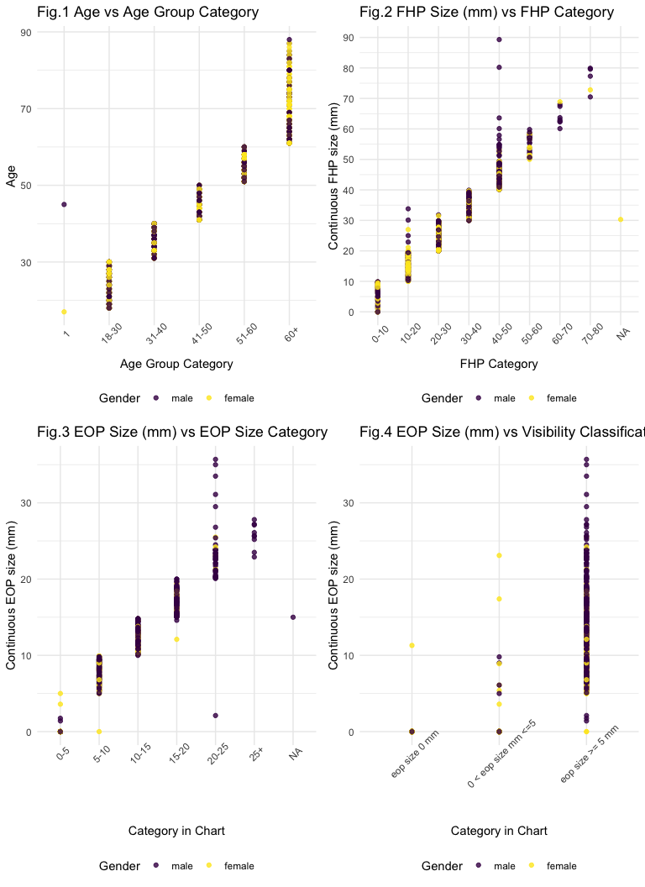

p8105\_mtp\_sl4662
================

# Problem 1

Some age group does not match the age. Age group 1 is not suppose to
appear, and there is an age 45, with age group 1.

``` r
mtp_data = 
  read_excel("p8105_mtp_data.xlsx", 
             skip = 8) %>% 
  janitor::clean_names() %>% 
  mutate(
    eop_size_mm = replace(eop_size_mm, is.na(eop_size_mm), "0"), 
    eop_size_mm = as.double(eop_size_mm), 
    sex = factor(sex, levels = c("1", "0")), 
    sex = fct_recode(sex, female = "0", male = "1"), 
    age_group = factor(age_group, levels = c("1", "2", "3", "4", "5", "6", "7", "8")),  
    age_group = fct_recode(age_group, 
                           "18-30" = "2", 
                           "31-40" = "3", 
                           "41-50" = "4", 
                           "51-60" = "5", 
                           "60+" = "6", 
                           "60+" = "7", 
                           "60+" = "8"),
    eop_size = factor(eop_size, levels = c("0", "1", "2", "3", "4", "5")), 
    eop_size = fct_recode(eop_size, 
                          "0-5" = "0", 
                          "5-10" = "1", 
                          "10-15" = "2", 
                          "15-20" = "3", 
                          "20-25" = "4", 
                          "25+" = "5"), 
    eop_visibility_classification = factor(eop_visibility_classification, levels = c("0", "1", "2")), 
    eop_visibility_classification = fct_recode(eop_visibility_classification, 
                                               "eop size 0 mm" = "0",
                                               "0 < eop size mm <=5" = "1", 
                                               "eop size >= 5 mm" = "2"),
    fhp_category = factor(fhp_category, levels = c("0", "1", "2", "3", "4", "5", "6", "7")),
    fhp_category = fct_recode(fhp_category, 
                              "0-10" = "0", 
                              "10-20" = "1", 
                              "20-30" = "2", 
                              "30-40" = "3", 
                              "40-50" = "4", 
                              "50-60" = "5", 
                              "60-70" = "6", 
                              "70-80" = "7")
    )

  
# levels(mtp_data$age_group) = c("1", "20+", "30+", "40+", "50+", "60+", "60+", "60+")

age_female = 
  mtp_data %>% 
  filter(sex == "female") %>% 
  group_by(age_group) %>% 
  summarize(female_number = n())

age_male = 
  mtp_data %>% 
  filter(sex == "male") %>% 
  group_by(age_group) %>% 
  summarize(male_number = n())

left_join(age_female, age_male, by = "age_group") %>% 
  knitr::kable()
```

| age\_group | female\_number | male\_number |
| :--------- | -------------: | -----------: |
| 1          |              1 |            1 |
| 18-30      |            151 |          152 |
| 31-40      |            102 |          102 |
| 41-50      |            106 |          101 |
| 51-60      |             99 |          101 |
| 60+        |            155 |          150 |

This dataset is consist of many different variables, and some variables
have conclusive variables following them to classify the results into
different groups.

Key variables include :

There are 9 variables and 1221 observations in this data set. There is a
total of 1221 participants.

age = mtp\_data %\>% mutate( age = case\_when( age \< 18 \~ “\<18”, age
\> 17 & age \< 31 \~ “18-30”, age \> 30 & age \< 41 \~ “31-40”, age \>
40 & age \< 51 \~ “41-50”, age \> 50 & age \< 61 \~ “51-60”, age \> 60
\~ “\>60”, TRUE \~ "" )) %\>% janitor::tabyl(sex, age) %\>%
select(“sex”, “\<18”, “18-30”,“31-40”,“41-50”,“51-60”,“\>60”)

age\_cat = mtp\_data %\>% mutate( age\_cat = case\_when( age\_group ==
“1” \~ “\<18”, age\_group == “18-30” \~ “18-30”, age\_group == “31-40”
\~ “31-40”, age\_group == “41-50” \~ “41-50”, age\_group == “51-60” \~
“51-60”, age\_group == “60+” \~ “\>60”, TRUE \~ "" )) %\>%
janitor::tabyl(sex, age\_cat) %\>% select(“sex”, “\<18”,
“18-30”,“31-40”,“41-50”,“51-60”,“\>60”)

aa = bind\_rows(age\_cat, age) %\>% pivot\_longer( names\_to = female,
values\_from = )

eop = mtp\_data %\>% mutate( eop = case\_when( “eop\_size mm” \< 18 \~
“\<18”, age \> 17 & age \< 31 \~ “18-30”, age \> 30 & age \< 41 \~
“31-40”, age \> 40 & age \< 51 \~ “41-50”, age \> 50 & age \< 61 \~
“51-60”, age \> 60 \~ “\>60”, TRUE \~ "" )) %\>% janitor::tabyl(sex,
age\_cat)

``` r
eop1 = 
mtp_data %>%
  ggplot(aes(x = eop_size, y = eop_size_mm, color = sex)) + 
    geom_point(alpha = 0.8) + 
    labs(
    color = "Gender",
    title = "EOP Size (mm) vs EOP Size Category",
    x = "Category in Chart",
    y = "Continuous EOP size (mm)") +
  theme(axis.text.x = element_text(angle = 45))
eop2 = 
mtp_data %>%
  ggplot(aes(x = eop_visibility_classification, y = eop_size_mm, color = sex)) + 
    geom_point(alpha = 0.8) + 
    labs(
    color = "Gender",
    title = "EOP Size (mm) vs Visibility Classification",
    x = "Category in Chart",
    y = "Continuous EOP size (mm)") +
  theme(axis.text.x = element_text(angle = 45))

fhp = 
mtp_data %>%
  ggplot(aes(x = fhp_category, y = fhp_size_mm, color = sex)) + 
    geom_point(alpha = 0.8) + 
    labs(
    color = "Gender",
    title = "FHP Size (mm) vs FHP Category",
    x = "FHP Category",
    y = "Continuous FHP size (mm)") +
  theme(axis.text.x = element_text(angle = 45))

age = 
mtp_data %>%
  ggplot(aes(x = age_group, y = age, color = sex)) + 
    geom_point(alpha = 0.8) + 
    labs(
    color = "Gender",
    title = "Age vs Age Group Category",
    x = "Age Group Category",
    y = "Age") +
  theme(axis.text.x = element_text(angle = 45))
  
(age + fhp) / (eop1 + eop2)
```



``` r
age_based = 
  mtp_data %>% 
  filter(sex == "female") %>% 
  count(age) %>% 
  group_by(age > "17" & age < "31", age > "30" & age < "41") %>% 
  summarise(sum = sum(n))

mtp_data %>% 
  filter(sex == "male") %>% 
  count(age)
```

    ## # A tibble: 67 x 2
    ##      age     n
    ##    <dbl> <int>
    ##  1    18    11
    ##  2    19    18
    ##  3    20    11
    ##  4    21    12
    ##  5    22    15
    ##  6    23    11
    ##  7    24    12
    ##  8    25     9
    ##  9    26    11
    ## 10    27    10
    ## # … with 57 more rows

``` r
mtp_data %>% 
  count(age)
```

    ## # A tibble: 72 x 2
    ##      age     n
    ##    <dbl> <int>
    ##  1    17     1
    ##  2    18    22
    ##  3    19    33
    ##  4    20    26
    ##  5    21    22
    ##  6    22    29
    ##  7    23    21
    ##  8    24    21
    ##  9    25    21
    ## 10    26    22
    ## # … with 62 more rows

# Problem 2

``` r
fhp_p = 
ggplot(data = mtp_data, aes(x = age, y = fhp_size_mm, color = sex)) + 
  geom_point(aes(group = sex), alpha = .5) + 
  geom_smooth() +
  labs(
    color = "Gender",
    title = "FHP size (mm) vs Age",
    x = "Age",
    y = "FHP size (mm)")

gender_total = 
  mtp_data %>% 
  group_by(sex, age_group) %>% 
  summarise(Total = n()) %>% 
  filter(!(age_group == "1"))
  

enlarge = 
  mtp_data %>% 
  filter(eop_size_mm >= 10) %>% 
  group_by(sex, age_group) %>% 
  summarise(enlarge = n()) 

gender_enlarge = 
  left_join(gender_total, enlarge, by = c("age_group","sex")) %>% 
  mutate(enlarge_rate = (enlarge / Total))

enlarge_rate_p = 
ggplot(data = gender_enlarge, aes(x = age_group, y = enlarge_rate, color = sex)) + 
  geom_line(aes(group = sex), alpha = .5) + 
  labs(
    color = "Gender",
    title = "rate of enlarged EOP vs Age Groups",
    x = "Age Groups",
    y = "Rate of Enlarged EOP")

(fhp_p + enlarge_rate_p)
```

    ## `geom_smooth()` using method = 'loess' and formula 'y ~ x'


``` r
female = 
  mtp_data %>% 
  filter(sex == "female") %>% 
  filter(!(age_group == "1"))
female_plot = 
  ggplot(data = female, aes(x = eop_size_mm, y = fhp_size_mm, color = age_group)) + 
  geom_point(alpha = .5) +
  geom_smooth() +
  facet_grid(. ~ age_group)

male = 
  mtp_data %>% 
  filter(sex == "male") %>% 
  filter(!(age_group == "1"))
male_plot = 
  ggplot(data = male, aes(x = eop_size_mm, y = fhp_size_mm, color = age_group)) + 
  geom_point(alpha = .5) +
  geom_smooth() +
  facet_grid(. ~ age_group)

female_plot / male_plot
```

    ## `geom_smooth()` using method = 'loess' and formula 'y ~ x'
    ## `geom_smooth()` using method = 'loess' and formula 'y ~ x'


